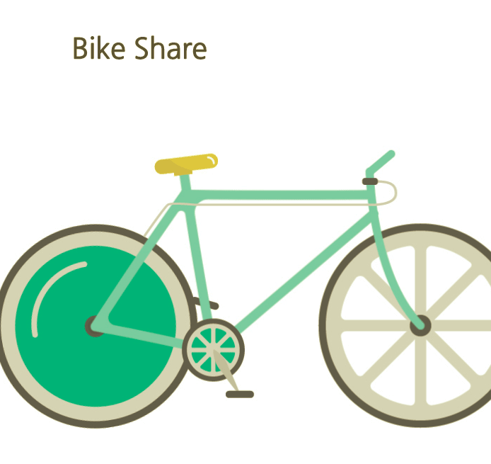

## Bike Share

This website allows you to find bike share locations throughout the world, providing the real time status of bike and bike slots availability.

## Instructions

* Click on the deployed link below to view the app.
* To learn a little more about the app and find the link to the API used, click "About" in the navigation bar at the top of the page.
* To view bike share businesses by city, click "Find A Bike" in the navigation bar at the top of the page, select a country from the "Select A Country" dropdown menu, and select a city from the "Select A City" dropdown menu.
    * To then view the bike station names, and available slots and bikes at those stations, simply click "Bike Stations".
* To change the city or country of choice, reselect either from their respective dropdown menus.

## Deployed Link

Click [here](https://project-2-bike-share.firebaseapp.com) to check out bike shares in your area!

## Technologies
JavaScript, HTML, CSS, Firebase

## Author

Allison Livingston  
Email: allisonlivingston16@gmail.com  
LinkedIn: https://www.linkedin.com/in/allisonlivingston16/
